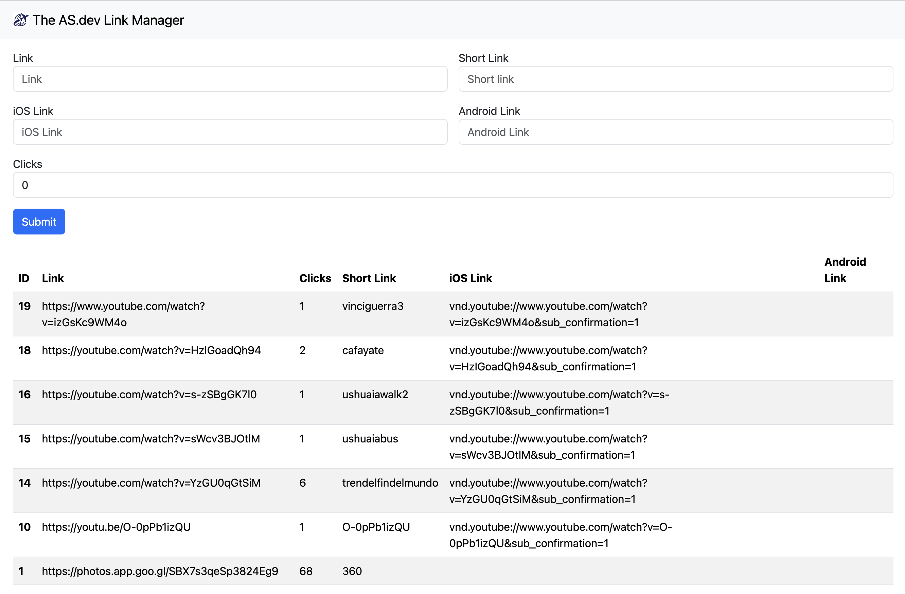

# The AS.dev Link Manager

A simple short link/URL shortener manager written in pure PHP for those who want:

* Custom domain
* Open in app
* Unlimited custom short link
* Unlimited clicks
* Link count tracking
* Edit custom links
* Improve on your own

Without thinking about pricing or any limitation.

I've created this project because I wanted the YouTube videos links from my travel account [Viajar com Alê](https://viajarcomale.com) I post on Instagram stories to open on the YouTube app itself and not on the Instagram webview, I noticed that the app opens if we use the `vnd.youtube://` protocol, also I wanted to someway use a subdomain on my website [as.dev](https://as.dev) to create redirections to those videos, I've analyzed the current URL shorteners platforms and all of them had some limitation that I would need to pay now or in the future, so I've decided to create my own.

## Demo

This project is stored on [https://l.as.dev](https://l.as.dev), when accessing https://l.as.dev/insert.php and typing the right username and password you'll be presented to a screen showing the next screenshot contents, where we can add new links and shortlinks, choose what to open on an iOS device and on an Android device.

When accessing https://l.as.dev/360, you'll be redirected to the Viajar com Alê Shared 360 photos album on Google Photos, when accessing https://l.as.dev/vinciguerra3 on your mobile device, it'll open the YouTube app on the Viajar com Alê Glaciar Vinciguerra Trekking - Part 3 - 360 Video, on every access the click number is increased and when accessing https://l.as.dev you'll be redirected to https://viajarcomale.com

As this project was mainly created to share YouTube videos, you can just paste the YouTube link and it'll automatically create the mobile links and if you don't specify the short link, it'll use the YouTube ID as the shortlink.

## Installation

To use this project you just need to drop the `.htaccess`, `init.php`, `index.php` and `insert.php` files on your PHP/Apache server and create a database with the table inside `links.sql`.

Then edit the `env.example` file with the database credentials and the username and password you want to use when accessing `insert.php` and drop it as `.env` on the same directory on your server.

Accessing `your.url/insert.php` should as for the username and password you filled out on the `.env` file, create some shortlinks and you should be able to access it typing `your.url/your_shortlink` on your browser.

You can also test it locally using Docker compose, just run `docker-compose up` and access http://localhost:8000/insert.php
